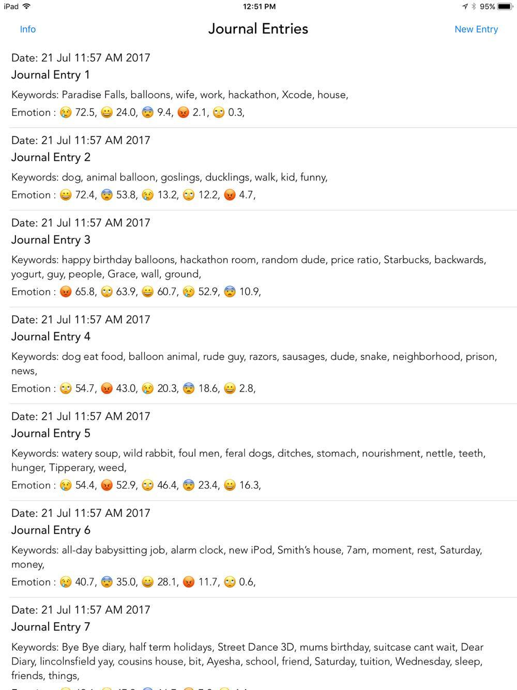

# Dear Watson

Dear Watson is a digital journal companion that helps you understand your emotions better. Instead of typing, you can simply talk to the app as if you were talking to a friend, and the app will transcribe for you. Using IBM Watson Tone Analyzer and Natural Language Understanding Services, the app automatically analyzes your journal entry and gives information about your emotions and summarizes the highlights of your day. You can view graphs and reflect on how your emotions have changed over the past week.

## How It Works 

### Creating a New Journal Entry 

<!--{:height="50%" width="50%"}-->

Press the red button to start recording your journal entry. Dear Watson transcribes your speech and displays it on the screen. IBM Watson Tone Analyzer service analyzes your emotions, and Dear Watson gives different responses based on the result. The emoji in the center of the screen will change accordingly and prompts you to speak more about your day. 

### See Highlights of Your Day 

<!---->

You can view any of your previous entries to refresh your memory of the events that day and how you felt. Additionally, you can see a graph of your emotions over time, as well as keywords to remind you of what you did each day.
